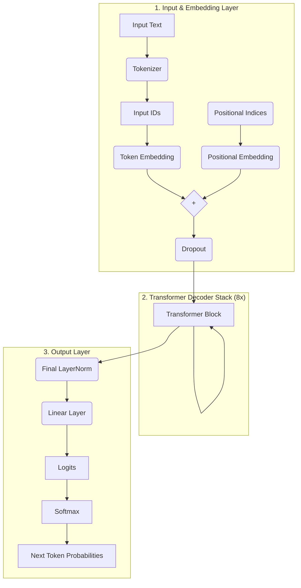

# Katha-GPT: A Marathi Story Generation Model

<div align="center">
  
  
  
  
</div>

---

**Katha-GPT** is a custom, from-scratch implementation of a decoder-only Transformer (GPT) model trained to generate short, creative stories in the **Marathi language**. This project demonstrates the complete lifecycle of building a generative language model, from data preparation and model architecture design to training and interactive text generation.

The model is named "Katha" (कथा), which means "story" in Marathi, reflecting its primary function.

## Table of Contents
- [Project Overview](#project-overview)
- [Key Features](#key-features)
- [Model Architecture](#model-architecture)
- [Dataset](#dataset)
- [Results](#results)
- [Setup and Installation](#setup-and-installation)
- [Usage](#usage)
  - [Training a New Model](#training-a-new-model)
  - [Generating Text](#generating-text)
- [Architecture Diagram](#architecture-diagram)
- [Future Scope](#future-scope)
- [License](#license)
- [Acknowledgements](#acknowledgements)

## Project Overview
The goal of this project was to build a generative AI model capable of understanding a Marathi prompt and continuing it into a coherent and contextually relevant short story. Instead of relying on pre-existing frameworks like `transformers` for the model itself, this project implements the GPT architecture from the ground up using PyTorch to provide a deeper understanding of the underlying mechanics.

The model is significantly smaller than large-scale models like GPT-3, making it feasible to train on consumer-grade hardware.

## Key Features
- **Custom GPT Implementation:** The core transformer architecture is built from scratch using PyTorch `nn.Module`.
- **Marathi Language Focus:** Specifically trained on a large corpus of Marathi stories.
- **Coherence Enhancement:** Implements modern text generation techniques like:
  - Temperature, Top-k, and Top-p (Nucleus) sampling.
  - Repetition penalty and n-gram blocking to avoid monotonous output.
- **Efficient Training:**
  - Utilizes `torch.cuda.amp` for Mixed Precision training.
  - Implements Gradient Accumulation to simulate larger batch sizes.
  - Uses a Cosine Annealing learning rate scheduler for stable convergence.
- **Interactive Generation:** Includes a command-line interface to generate stories interactively with customizable parameters.
- **Flexible Workflow:** Supports training from scratch or resuming from a saved checkpoint.

## Model Architecture
Katha-GPT is a decoder-only Transformer model. Its architecture is defined by the following hyperparameters:

| Hyperparameter      | Value     | Description                               |
| ------------------- | --------- | ----------------------------------------- |
| `vocab_size`        | 50,257    | Size of the Marathi tokenizer vocabulary. |
| `block_size`        | 256       | The context window size (max sequence length). |
| `n_layer`           | 8         | Number of stacked Transformer blocks.     |
| `n_head`            | 8         | Number of attention heads in each block.  |
| `n_embd`            | 512       | The dimensionality of the token embeddings. |
| **Total Parameters**| **~51 M**   | The total number of trainable parameters. |

Each Transformer block consists of a multi-head self-attention layer followed by a feed-forward neural network, with residual connections and layer normalization.

## Dataset
The model was trained on the **`TinyStories-Regional/marathi-generated_4o-mini_2M`** dataset from Hugging Face.
- **Description:** A corpus of 2 million short stories in Marathi, generated by a larger language model.
- **Preprocessing:** The text was tokenized using the pre-trained `l3cube-pune/marathi-gpt` tokenizer and saved into efficient binary files for fast data loading during training.
- **Split:** The data was split into a 98% training set and a 2% validation set.

## Results
After training for **20,000 iterations**, the model achieved the following performance on the validation set:
- **Best Validation Loss:** **2.6005**
- **Best Perplexity:** **13.47**

The generated examples show that the model can produce coherent and imaginative continuations for a given Marathi prompt.

**Example Generation:**
> **Prompt:** `एकदा एका जंगलात एक लहान वाघ होता` (Once, there was a small tiger in a forest)
> 
> **Generated Text:** `एकदा एका जंगलात एक लहान वाघ होता. त्याचे नाव होते 'चिंकी'. चिंकीला जंगलातील सर्व प्राणी आवडत असत. तो नेहमी आपल्या मित्रांसोबत खेळत असे आणि त्यांना आनंद देत असे. एक दिवस, जंगलात एक मोठा उत्सव झाला. त्या उत्सवात सर्व प्राण्यांनी एकत्र येऊन गाणी गाणे सुरू केले...`
> (Once, there was a small tiger in a forest. His name was 'Chinki'. Chinki loved all the animals in the forest. He would always play with his friends and make them happy. One day, there was a big festival in the forest. In that festival, all the animals came together and started singing songs...)

## Setup and Installation
To run this project, you will need Python 3.9+ and a CUDA-enabled GPU is highly recommended for training.

1.  **Clone the repository:**
    ```bash
    git clone https://github.com/vedantNeve/katha-gpt.git
    cd katha-gpt/kathaGPT_RBT23CB024_VedantNeve
    ```

2.  **Use the notebook:**

## Usage

The main script (`katha_gpt.ipynb` or a converted `.py` file) provides a flexible workflow.

### Training a New Model
To train the model from scratch, simply run the script. It will automatically download the dataset, preprocess it, and begin the training loop.

```bash
python train.py
```

The script will periodically save the best-performing model to `best_model.pt` and the final model to `marathi_gpt_final.pt`.

### Generating Text
After training, you can use the interactive generation mode to create your own stories.

1.  **Load the model for inference:** The script will automatically detect the saved model files. Choose the option to load the model for inference.
2.  **Enter the interactive loop:**
    ```
    ============================================================
    INTERACTIVE TEXT GENERATION
    ============================================================
    Type 'quit' to exit, 'help' for options
    ============================================================

    Prompt > एकदा एका तळ्यात बदके होती
    ```
3.  **Customize generation:** You can set parameters like temperature, max length, and generation method (sample or beam search).

## Architecture Diagram
The diagram below illustrates the forward pass of the Katha-GPT model, from input tokens to output probabilities.



## Future Scope
- **GUI Integration:** Develop a simple web-based interface (using Flask or Gradio) for easier public use.
- **Model Scaling:** Train a larger version of the model on a more diverse and extensive Marathi corpus.
- **Custom Tokenizer:** Train a custom Byte-Pair Encoding (BPE) tokenizer specifically on the story corpus to potentially improve performance.
- **Fine-tuning:** Fine-tune the pre-trained model on specific genres of Marathi literature, such as poetry or historical fiction.

## Acknowledgements
- The model architecture is inspired by Andrej Karpathy's `nanoGPT` and the original "Attention Is All You Need" paper.
- The dataset is provided by the `TinyStories-Regional` project on Hugging Face.
- `l3cube-pune` research group for their contributions to Marathi NLP community.